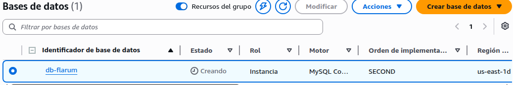
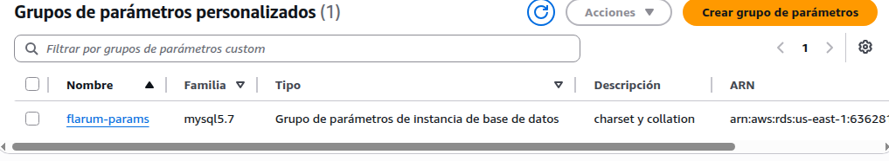
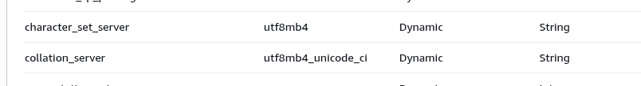
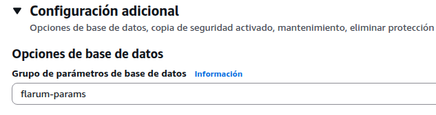
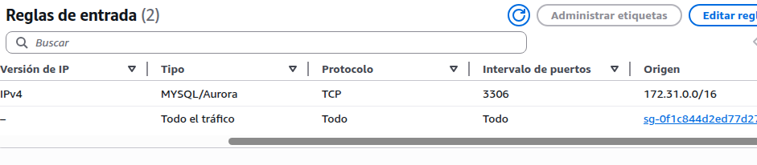

# Tarea A - Creación de Base de Datos en AWS RDS

## Objetivo

Crear una base de datos MySQL en AWS RDS que será utilizada por la aplicación Flarum desplegada en Elastic Beanstalk.

---

## Configuración de la instancia

| Parámetro | Valor         |
| --------- | ------------- |
| Motor     | MySQL 5.x     |
| Nombre BD | DB_flarum     |
| Usuario   | admFlarum     |
| Password  | Viu2022Flarum |

---

## Configuración de Charset y Collation

Dado que AWS RDS no permite configurar directamente estos valores en la creación, se utilizó un **Parameter Group personalizado**.

Parámetros configurados:

* character_set_server = utf8mb4
* collation_server = utf8mb4_unicode_ci

---

## Configuración de seguridad

Se configuró el grupo de seguridad asociado a la instancia RDS con la siguiente regla de entrada:

* Tipo: MySQL
* Puerto: 3306
* Origen: 172.31.0.0/16

Esto permite la conexión desde instancias dentro de la VPC por defecto de AWS, como Elastic Beanstalk.

---

## Proceso realizado

1. Creación de la base de datos en AWS RDS
2. Creación de un Parameter Group personalizado
3. Modificación de parámetros de charset y collation
4. Asociación del Parameter Group a la instancia RDS
5. Configuración del Security Group

---

## Evidencias

### 1. Base de datos creada

### 2. Grupo de parámetros creado

### 3. Configuración de charset y collation

### 4. Vinculación del Parameter Group

### 5. Reglas de entrada (Security Group)

---

## Resultado

La base de datos RDS fue creada correctamente, configurada con los parámetros requeridos y accesible desde la red interna de AWS, permitiendo su uso posterior por la aplicación Flarum.

---
