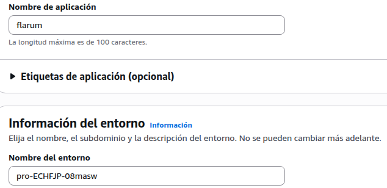
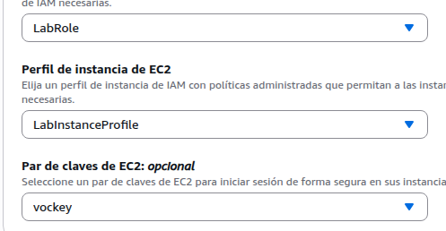
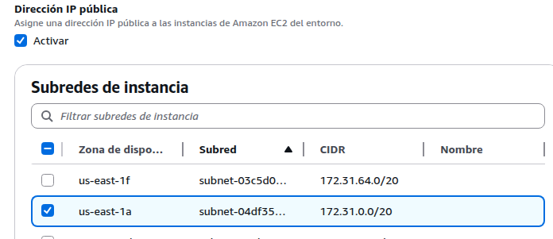
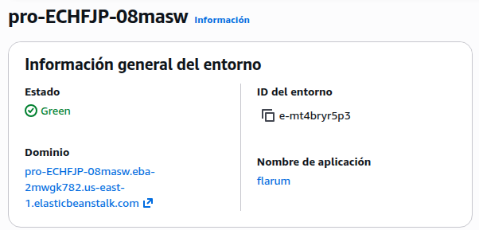
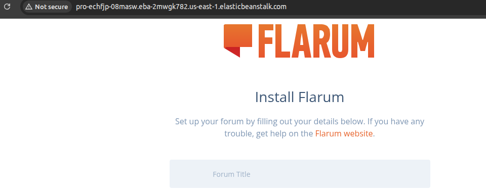
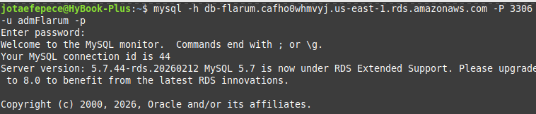
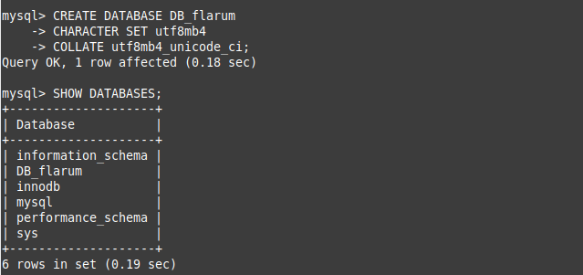
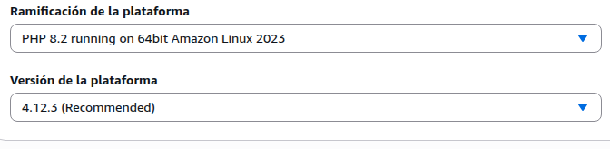
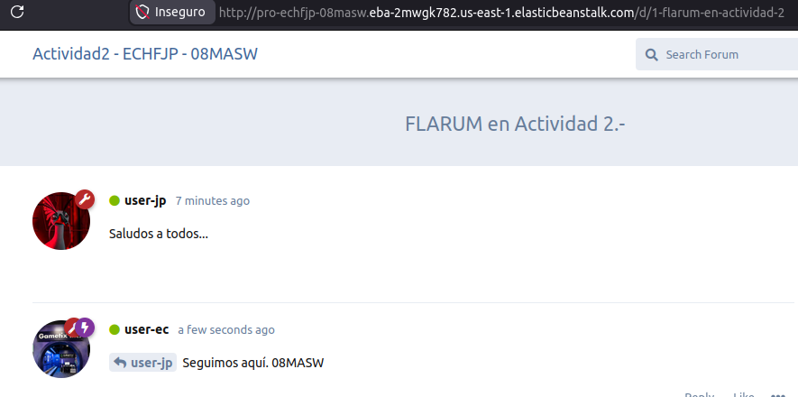

# Tarea B - Despliegue de Flarum en AWS Elastic Beanstalk

## Objetivo

Desplegar la aplicación Flarum en AWS Elastic Beanstalk y conectarla con la base de datos MySQL previamente creada en RDS.

---

## Configuración del entorno

| Parámetro        | Valor                 |
|-----------------|----------------------|
| Plataforma      | PHP 8.2              |
| Servicio        | AWS Elastic Beanstalk|
| Aplicación      | Flarum               |
| Base de datos   | MySQL (AWS RDS)      |

---

## Arquitectura

La solución implementada consiste en:

- Una instancia en Elastic Beanstalk ejecutando Apache + PHP  
- Una base de datos MySQL en RDS  
- Comunicación interna dentro de la VPC de AWS  

---

## Proceso de implementación

### 1. Creación del entorno en Elastic Beanstalk

Se creó el entorno para desplegar la aplicación Flarum, definiendo el nombre del entorno y la configuración base.

---

### 2. Configuración de servicios

Durante la creación del entorno se seleccionaron los servicios necesarios para ejecutar la aplicación.

---

### 3. Configuración de red y subredes

Se configuraron las subredes dentro de la VPC para permitir la comunicación con la base de datos en RDS.

---

### 4. Verificación del entorno desplegado

Una vez creado el entorno, se verificó su estado y configuración general.

---

### 5. Acceso inicial a Flarum

Se accedió a la URL proporcionada por Elastic Beanstalk, mostrando la pantalla inicial de instalación de Flarum.

---

### 6. Acceso temporal a la base de datos

Para crear la base de datos, se habilitó temporalmente el acceso público a RDS y se realizó conexión desde terminal.

---

### 7. Creación de la base de datos

Se creó manualmente la base de datos requerida por Flarum:

---

### 8. Ajuste de versión de PHP

Durante la instalación se presentó un error de compatibilidad con PHP 8.3, por lo que se cambió la versión del entorno a PHP 8.2.

---

### 9. Instalación final de Flarum

Con la configuración corregida, se completó exitosamente la instalación de Flarum.

---

## Problemas encontrados y soluciones

Durante el despliegue se presentaron los siguientes problemas:

- Error de conexión a RDS
Causa: base de datos no accesible públicamente. 

Solución: habilitar acceso temporal para creación de la BD.

- Error de compatibilidad PHP
Causa: uso de PHP 8.3 no soportado por Flarum. 

Solución: downgrade a PHP 8.2.

- Error de tablas existentes
Causa: instalación fallida previa. 

Solución: eliminar y recrear la base de datos.

**Resultados**

La aplicación Flarum fue desplegada correctamente en AWS Elastic Beanstalk y conectada exitosamente a la base de datos en RDS.

El sistema quedó completamente operativo, permitiendo el acceso al foro y la gestión de contenido.
