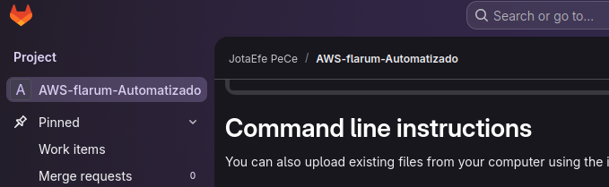
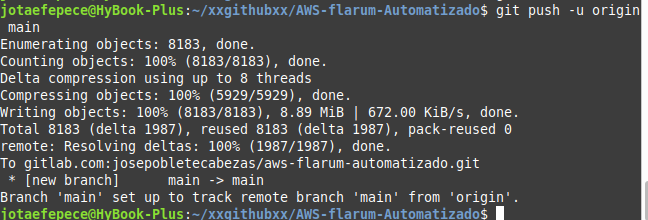
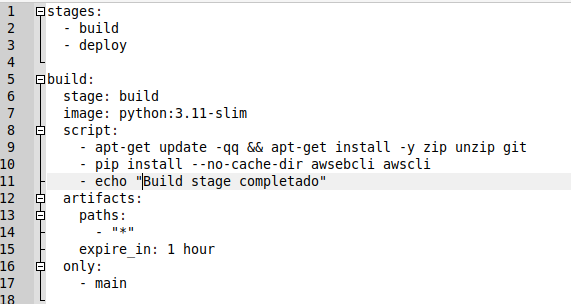
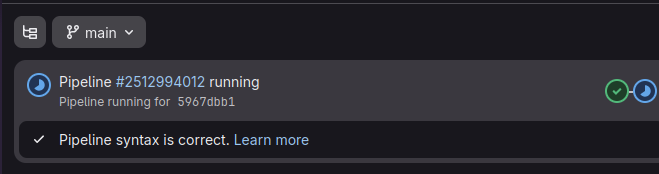
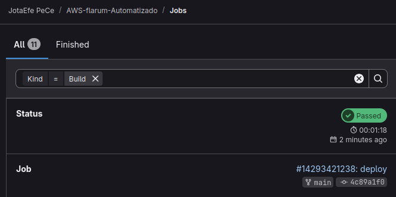
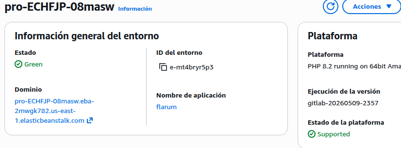
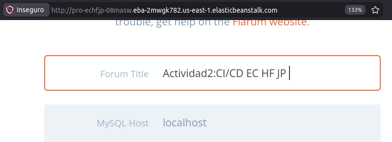

# Tarea C - Despliegue automatizado de Flarum con GitLab CI/CD en AWS Elastic Beanstalk

## Objetivo

Implementar un pipeline de integración y despliegue continuo (CI/CD) en GitLab para automatizar 
el despliegue de la aplicación Flarum en AWS Elastic Beanstalk, reutilizando el entorno creado en la Tarea 2.

---

## Configuración del entorno

| Parámetro       | Valor                |
|-----------------|----------------------|
| Plataforma      | PHP 8.2              |
| Servicio        | AWS Elastic Beanstalk|
| Aplicación      | Flarum               |
| CI/CD Tool      | GitLab CI/CD         |
| Base de datos   | MySQL (AWS RDS)      |
| Pipeline        | Build + Deploy       |

---

## Arquitectura

La solución implementada automatiza el flujo de despliegue mediante:

- Repositorio Git en GitLab con el código fuente de Flarum
- Pipeline CI/CD con GitLab Runner
- Etapas de build y deploy automatizadas
- Despliegue en AWS Elastic Beanstalk
- Base de datos MySQL en AWS RDS

---

## Proceso de implementación

### 1. Creación del proyecto en GitLab

Se creó un nuevo proyecto en GitLab para alojar el código fuente de la aplicación.

---

### 2. Migración del proyecto desde repositorio a GitLab

El código base de Flarum fue subido al repositorio de GitLab.

---

### 3. Configuración de variables de entorno en GitLab CI/CD

Se añadieron las credenciales de AWS como variables seguras para evitar exposición en el código.

---

### 4. Configuración del pipeline (.gitlab-ci.yml)

Se creó el archivo .gitlab-ci.yml con las etapas de build y deploy.

---

### 5. Ejecución del pipeline

El pipeline se ejecutó correctamente dentro de GitLab CI/CD.

---

### 6. Pipeline completado con éxito

El pipeline finalizó correctamente con estado Passed.

---

### 7. Actualización del entorno en Elastic Beanstalk

Se verificó que Elastic Beanstalk desplegó la nueva versión generada por GitLab.

---

### 8. Acceso final a la aplicación Flarum

Se accedió a la URL pública del entorno, confirmando el despliegue exitoso y la configuración del foro.

---

## Configuración del pipeline CI/CD

El pipeline se compone de dos etapas principales:

- Build: preparación del paquete de la aplicación
- Deploy: despliegue automático en AWS Elastic Beanstalk

Las credenciales de AWS se gestionan mediante variables de entorno en GitLab CI/CD para garantizar seguridad.

---

## Problemas encontrados y soluciones

Durante la implementación del pipeline se presentaron los siguientes problemas:

- Error de credenciales AWS
Causa: configuración inicial incorrecta de variables CI/CD

Solución: uso de variables seguras en GitLab CI/CD settings

- Error en ejecución del pipeline
Causa: configuración inicial del .gitlab-ci.yml

Solución: ajuste de stages build y deploy

- Latencia en despliegue en Elastic Beanstalk
Causa: propagación del nuevo artefacto

Solución: esperar actualización completa del entorno

**Conclusión**

Se logró implementar con éxito un sistema de despliegue automatizado utilizando GitLab CI/CD, 
permitiendo que cada cambio en el repositorio genere un despliegue automático en AWS Elastic Beanstalk.

Esto mejora significativamente el flujo de desarrollo al eliminar procesos manuales de despliegue y asegurar consistencia entre versiones.
